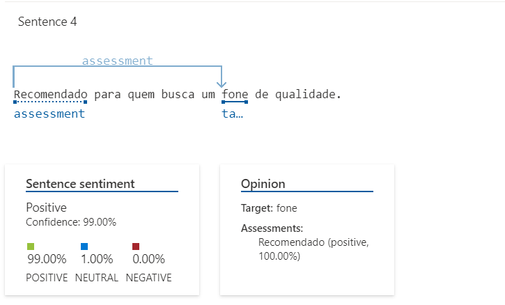

## Aplicação Prática da Análise de Sentimentos com Language Studio no Azure AI

## Introdução
Este repositório contém dados e resultados da análise de sentimento de um vendedor no Mercado Livre.

## Insights 
Durante o processo, observei alguns insights interessantes:
- Comentário 1: É excelente.
- Comentário 2: O fone é excelente

## Resultados da Análise
Os resultados da análise de sentimento estão disponíveis abaixo.

## Estrutura do Repositório
 - **inputs**: Nesta pasta, está armazenada os comentários de um fone de ouvido buluetooth de uma página do vendedor no Mercado Livre.
 - **README**: Este arquivo contém informações sobre o projeto.